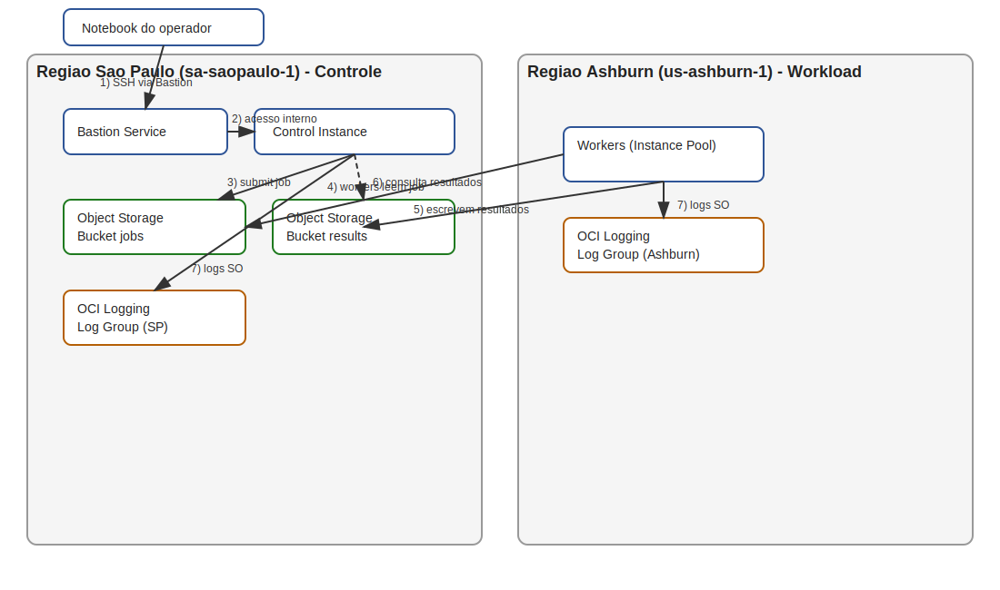

Desafio super legal e bem pratico de SRE, entao ja montei a infraestrutura como codigo, o desenho de arquitetura e um runbook para voce rodar.

**Resumo**
Este repositorio entrega uma plataforma distribuida multi-regiao na OCI com:
- Ambiente de controle em Sao Paulo (sa-saopaulo-1) acessado via Bastion.
- Execucao de workloads intensivos em outra regiao (padrao: us-ashburn-1).
- Submissao de jobs via Object Storage, sem acesso direto aos workers.
- Resultados centralizados em Sao Paulo e logs de SO enviados ao OCI Logging em cada regiao.

Arquivos principais:
- IaC: `iac/`
- Desenho draw.io: `docs/architecture.drawio`
- Decisoes de arquitetura (ADR): `docs/adr-001-arquitetura.md`
- Runbook: `runbook.md`
- Evidencias (template): `evidence/README.md`

**Arquitetura**

Notas rapidas:
- As instancias ficam em subnets privadas e nao recebem IP publico.
- O workload em Ashburn acessa o Object Storage em Sao Paulo via egress (NAT), pois Service Gateway e regional.
- Os logs do SO vao para OCI Logging em cada regiao, e os resultados ficam no bucket de results em SP.

**Decisoes Principais**
- Regiao secundaria: `us-ashburn-1` por ter 3 ADs, ampla disponibilidade de servicos e precos consistentes entre regioes, favorecendo previsibilidade de custo.
- Sem acesso direto ao workload: os workers nao expoem IP publico e nao recebem SSH externo.
- Submissao por fila simples em Object Storage: auditoria via versionamento e logs de API do OCI.
- Bastion gerenciado: evita jump host publico e reduz superficie de ataque.
- Logs: Log Groups e Logging Agent (Unified Agent) coletam `/var/log/messages`, `/var/log/secure` e `cloud-init.log`.

**Requisitos Funcionais Atendidos**
- Multi-regiao com Sao Paulo obrigatoria.
- Workload HPC simulado com `stress-ng` e resultados versionados.
- Acesso seguro e revogavel via IAM (grupo de operadores + Bastion sessions).
- IaC total com Terraform.

**Requisitos Nao-Funcionais (abordagem)**
- Latencia: regiao secundaria proxima e controle local em SP.
- Custos: NAT + instancias flex; pool ajustavel; buckets Standard.
- Disponibilidade: isolamento por regiao e sem SPOF de acesso publico.
- Pontos unicos de falha: control instance pode ser replicada (documentado no runbook).
- Manutenibilidade: padrao Terraform + scripts idempotentes.

**Como Rodar (resumo)**
1. Configure `iac/terraform.tfvars` a partir de `iac/terraform.tfvars.example`.
2. `terraform -chdir=iac init && terraform -chdir=iac apply`.
3. Crie uma Bastion session e conecte na control instance.
4. Submeta jobs com `submit_job.sh 120`.
5. Liste resultados com `list_results.sh` e baixe com `get_result.sh`.

Mais detalhes em `runbook.md`.
